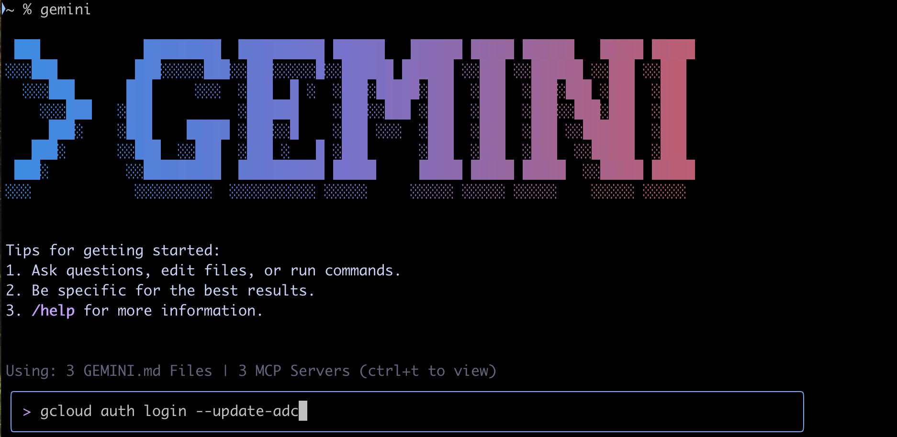
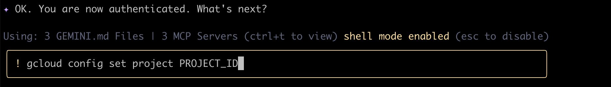
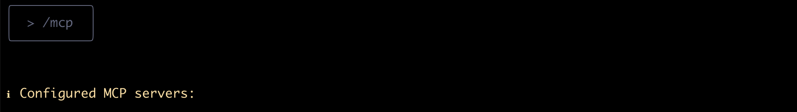
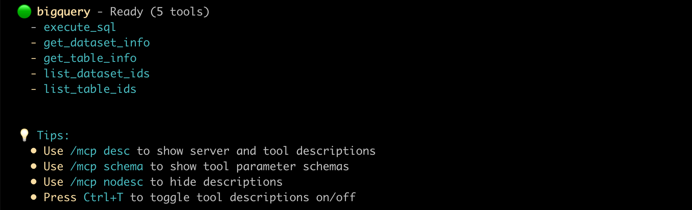
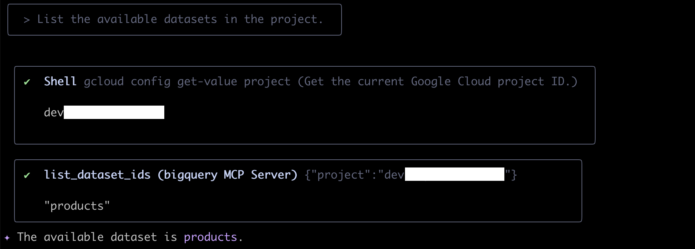
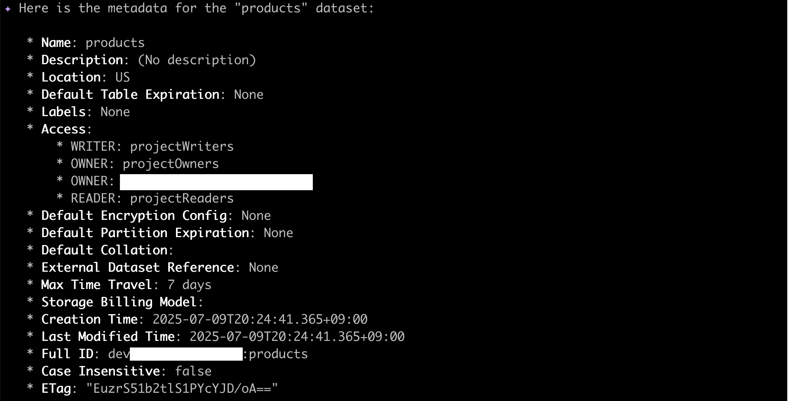
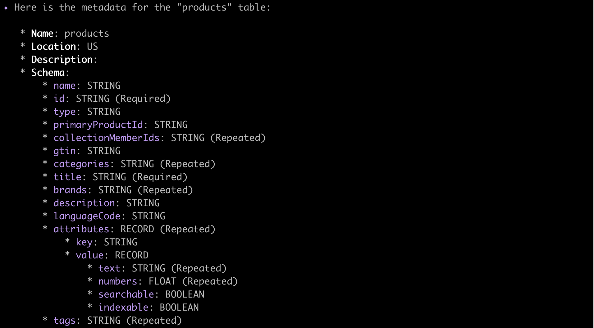
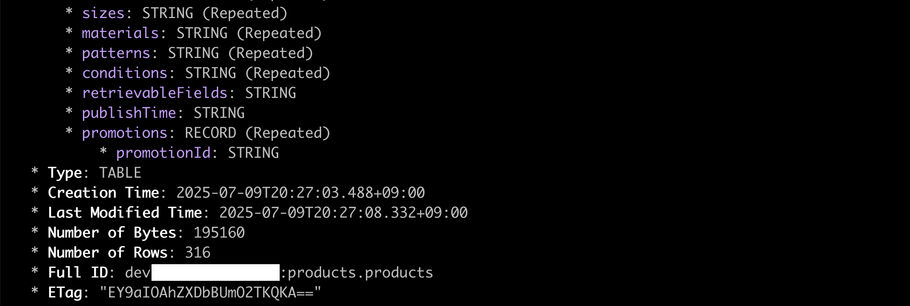
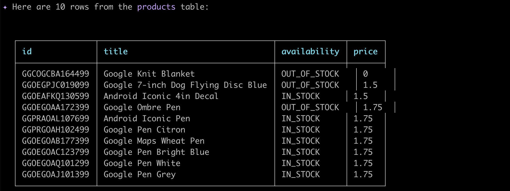

# Gemini CLI와 MCP Toolbox for Databases를 활용한 자연어 BigQuery 데이터 분석

이 문서는 Gemini CLI와 `MCP Toolbox for Databases`를 연동하여, 자연어를 통해 Google Cloud BigQuery의 데이터를 손쉽게 조회하고 분석하는 방법을 안내합니다. 이 예제를 통해 Google Cloud의 다양한 데이터베이스를 자연어로 다루는 강력한 기능을 확인해 보세요.


## 사전 준비

*   Google Cloud 계정 및 프로젝트
*   `gcloud` CLI 설치 및 기본 설정

## 1. MCP Toolbox for Databases 설치

`MCP Toolbox for Databases`는 Google Cloud 데이터베이스와 상호작용할 수 있는 도구 모음입니다. 아래 링크를 참고하여 자신의 운영체제(OS)와 CPU 아키텍처에 맞는 바이너리를 다운로드하고 설치하세요.

*   **설치 가이드:** [MCP Toolbox for Databases 설치](https://github.com/googleapis/genai-toolbox?tab=readme-ov-file#installing-the-server)

**[주의]** OS와 CPU 아키텍처에 맞는 올바른 바이너리를 선택하는 것이 매우 중요합니다.

더 자세한 로컬 BigQuery 연동 시작 방법은 아래 퀵스타트 문서를 참고할 수 있습니다.
*   **참고:** [Quickstart (Local with BigQuery)](https://googleapis.github.io/genai-toolbox/samples/bigquery/local_quickstart/)

## 2. Gemini CLI에 MCP 서버 등록

Gemini CLI가 MCP Toolbox를 인식하고 사용할 수 있도록 설정 파일에 서버 정보를 등록해야 합니다. Gemini CLI 설정 파일에 아래 `mcpServers` 설정을 추가하세요.

```json
{
  "mcpServers": {
    "bigquery": {
      "command": "toolbox",
      "args": ["--prebuilt", "bigquery", "--stdio"],
      "env": {
         "BIGQUERY_PROJECT": "[YOUR_PROJECT_ID]",
         "BIGQUERY_LOCATION": "[YOUR_REGION]"
      }
    }
  }
}
```
*   `[YOUR_PROJECT_ID]`: 사용자의 Google Cloud 프로젝트 ID로 변경하세요.
*   `[YOUR_REGION]`: BigQuery 데이터셋이 위치한 리전(e.g., `us-central1`)으로 변경하세요.

## 3. Google Cloud 인증 및 설정

MCP Toolbox가 BigQuery에 접근하려면 Google Cloud 인증이 필요합니다.

1.  **Google Cloud 인증 (Application Default Credentials):**
    

2.  **기본 Google Cloud 프로젝트 설정 (`PROJECT_ID`를 실제 프로젝트 ID로 변경):**
    
    

3.  **기본 Google Cloud 리전 설정 (`us-central1`을 실제 리전으로 변경):**
    
    
    

4.  **설정된 MCP 서버 및 도구 목록 확인:**
    
    

## 4. 실행 예제

이제 자연어 프롬프트를 통해 BigQuery 데이터를 탐색할 수 있습니다.

> **프로젝트 내 데이터셋 목록 조회:** "List the available datasets in the project."
> 

> **데이터셋 메타데이터 확인:** "Get the metadata for the dataset."
> 
> 

> **데이터셋 내 테이블 목록 조회:** "List tables in the dataset."
> 

> **테이블 메타데이터 확인:** "Get the metadata for the table."
> 
> 
> 

> **SQL 실행 (예: 테이블에서 10개 행 검색):** "Execute a sql (e.g., `Retrieve 10 rows from the table`)"
> 
> 

## 참고 자료

- [MCP Toolbox for Databases](https://googleapis.github.io/genai-toolbox/getting-started/)
  - [Get started running Toolbox locally with BigQuery](https://googleapis.github.io/genai-toolbox/samples/bigquery/local_quickstart/)
  - [How to configure Toolbox’s tools.yaml file](https://googleapis.github.io/genai-toolbox/getting-started/configure/)
    - [prebuilt config files](https://github.com/googleapis/genai-toolbox/tree/main/internal/prebuiltconfigs/tools)
- [MCP Toolbox for Databases: Making BigQuery datasets available to LLMs](https://codelabs.developers.google.com/mcp-toolbox-bigquery-dataset?hl=en#6)
