# Natural Language BigQuery Data Analysis with Gemini CLI and MCP Toolbox for Databases

This document guides you on how to connect Gemini CLI with `MCP Toolbox for Databases` to easily query and analyze data in Google Cloud BigQuery using natural language. Through this example, you can explore the powerful capabilities of handling various Google Cloud databases with natural language.


## Prerequisites

*   Google Cloud account and project
*   `gcloud` CLI installed and configured

## 1. Install MCP Toolbox for Databases

`MCP Toolbox for Databases` is a suite of tools that allows interaction with Google Cloud databases. Refer to the link below to download and install the correct binary for your operating system (OS) and CPU architecture.

*   **Installation Guide:** [Install MCP Toolbox for Databases](https://github.com/googleapis/genai-toolbox?tab=readme-ov-file#installing-the-server)

**[NOTE]** It is crucial to select the correct binary for your OS and CPU architecture.

For more detailed instructions on getting started with a local BigQuery integration, you can refer to the quickstart document below.
*   **Reference:** [Quickstart (Local with BigQuery)](https://googleapis.github.io/genai-toolbox/samples/bigquery/local_quickstart/)

## 2. Register the MCP Server in Gemini CLI

To allow Gemini CLI to recognize and use the MCP Toolbox, you need to register the server information in the configuration file. Add the following `mcpServers` configuration to your Gemini CLI settings file.

```json
{
  "mcpServers": {
    "bigquery": {
      "command": "toolbox",
      "args": ["--prebuilt", "bigquery", "--stdio"],
      "env": {
         "BIGQUERY_PROJECT": "[YOUR_PROJECT_ID]",
         "BIGQUERY_LOCATION": "[YOUR_REGION]"
      }
    }
  }
}
```
*   `[YOUR_PROJECT_ID]`: Replace with your Google Cloud project ID.
*   `[YOUR_REGION]`: Replace with the region where your BigQuery dataset is located (e.g., `us-central1`).

## 3. Google Cloud Authentication and Configuration

The MCP Toolbox requires Google Cloud authentication to access BigQuery.

1.  **Authenticate with Google Cloud (Application Default Credentials):**
    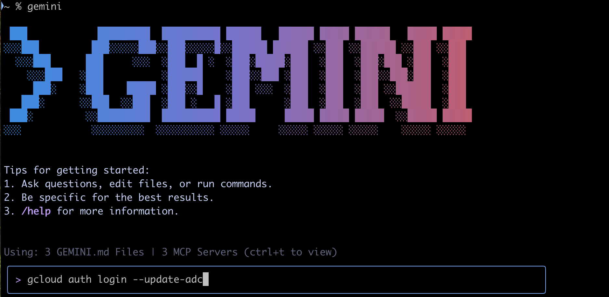

2.  **Set your default Google Cloud project (replace `PROJECT_ID` with your actual project ID):**
    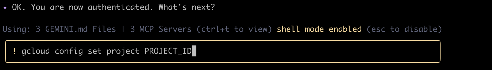
    

3.  **Set your default Google Cloud region (replace `us-central1` with your actual region):**
    
    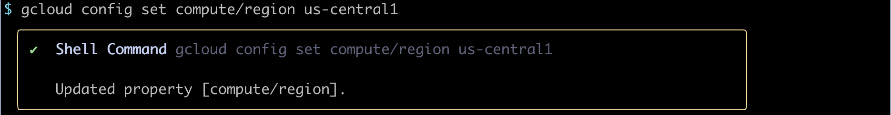
    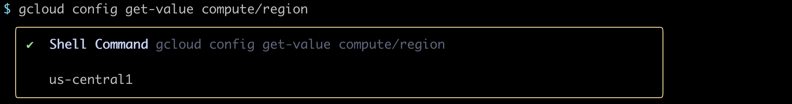

4.  **List the configured MCP servers and tools:**
    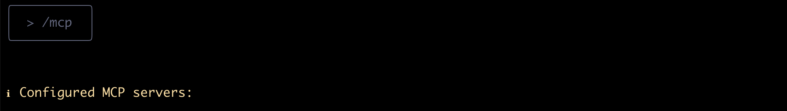
    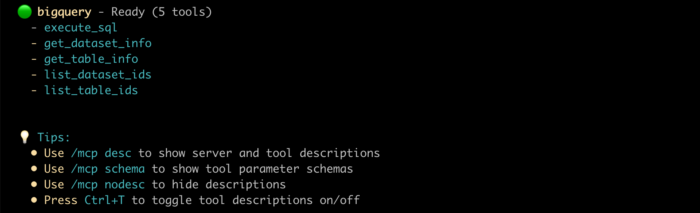

## 4. Usage Examples

Now you can explore your BigQuery data using natural language prompts.

> **List datasets in the project:** "List the available datasets in the project."
> 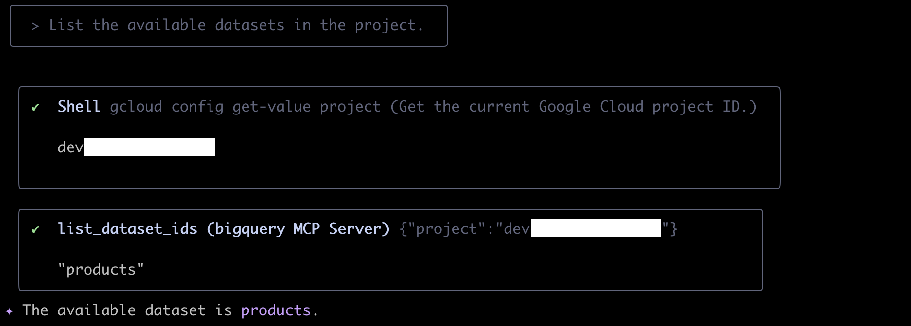

> **Get metadata for the dataset:** "Get the metadata for `products` dataset."
> 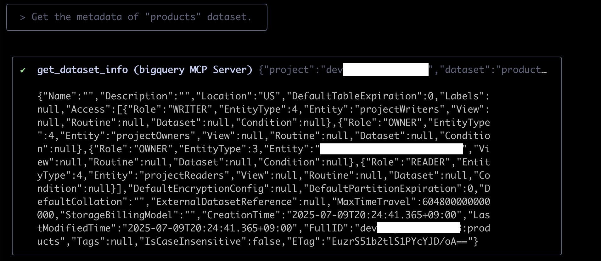
> 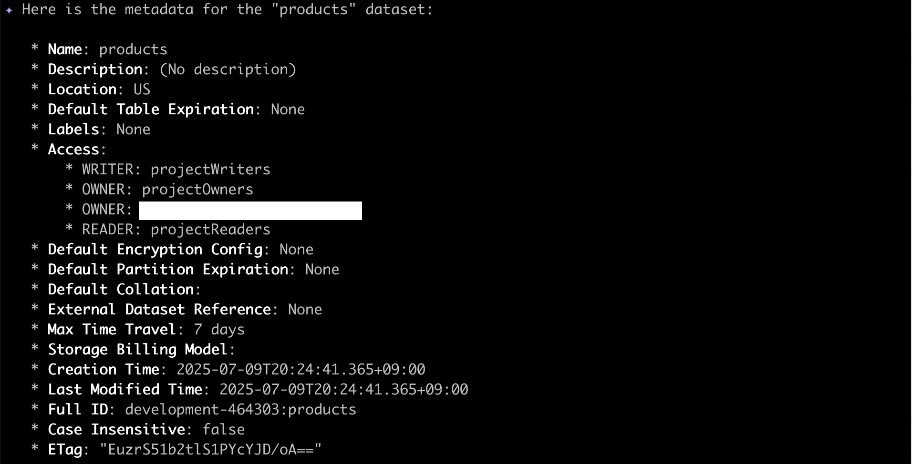

> **List tables in the dataset:** "List tables in `products` dataset."
> 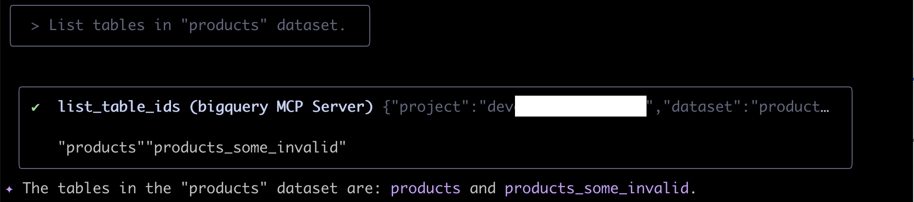

> **Get metadata for the table:** "Get the metadata for `products` table."
> 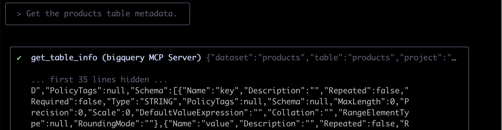
> 
> 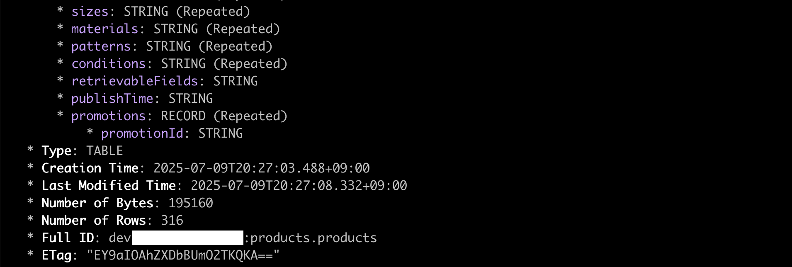

> **Execute SQL:** "Execute a sql (e.g., `Retrieve 10 rows from products table`)"
> 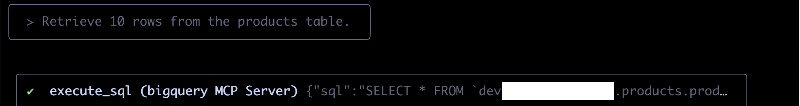
> 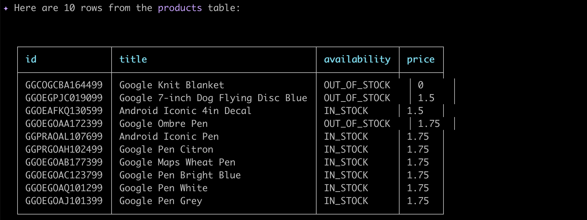

## References

- [MCP Toolbox for Databases](https://googleapis.github.io/genai-toolbox/getting-started/)
  - [Get started running Toolbox locally with BigQuery](https://googleapis.github.io/genai-toolbox/samples/bigquery/local_quickstart/)
  - [How to configure Toolbox’s tools.yaml file](https://googleapis.github.io/genai-toolbox/getting-started/configure/)
    - [prebuilt config files](https://github.com/googleapis/genai-toolbox/tree/main/internal/prebuiltconfigs/tools)
- [MCP Toolbox for Databases: Making BigQuery datasets available to LLMs](https://codelabs.developers.google.com/mcp-toolbox-bigquery-dataset?hl=en#6)
